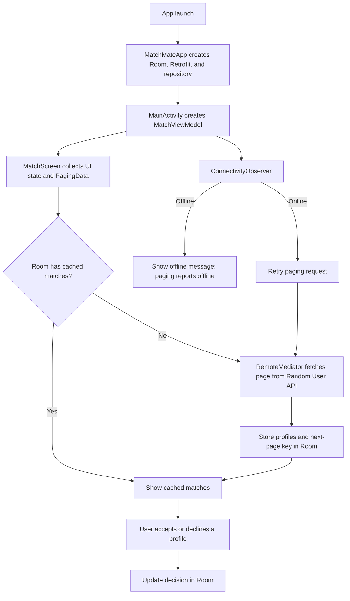

# MatchMate

MatchMate is a small Android app for browsing profile matches, recording an
accept/decline decision, and continuing to show cached results while offline.

## Features

- Fetches profile data from the [Random User API](https://randomuser.me/).
- Displays profiles in a paginated Jetpack Compose feed.
- Caches profiles and decisions locally with Room.
- Detects network availability and retries loading when the connection returns.
- Persists accept and decline choices locally.

## App flow



## Architecture

```text
Compose UI
  -> MatchViewModel
  -> MatchRepository
  -> Room database / Retrofit API
```

`RemoteMediator` coordinates paged API requests with the Room cache. The
database is the single local source for the feed and persisted decisions.

## Tech stack

- Kotlin and Jetpack Compose
- Paging 3 and Room
- Retrofit with Gson
- Coil for profile images
- Kotlin Coroutines and Flow

## Run locally

1. Clone the repository.
2. Open it in Android Studio.
3. Let Gradle sync finish.
4. Run the `app` configuration on an emulator or Android device running API 26+
   with internet access.

## Project layout

```text
app/src/main/java/com/harshvardhan/matchmate/
├── data/       # Room entities/DAO, Retrofit DTOs, repository
├── domain/     # Match status model
├── ui/         # Compose screen, cards, UI state, ViewModel
├── util/       # Connectivity observer
```

## Notes

The current backend is read-only: profile data comes from Random User API.
Accept/decline decisions are stored locally
